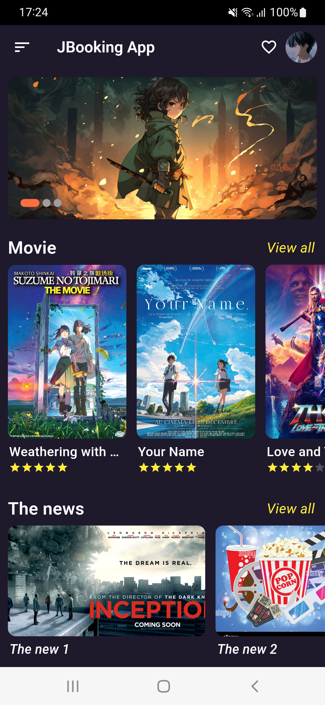
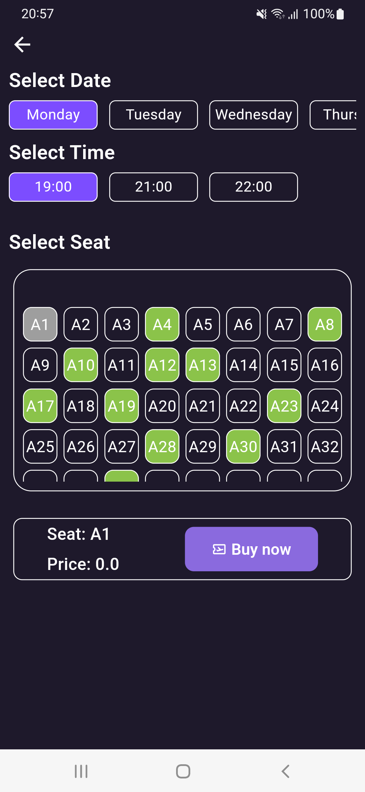
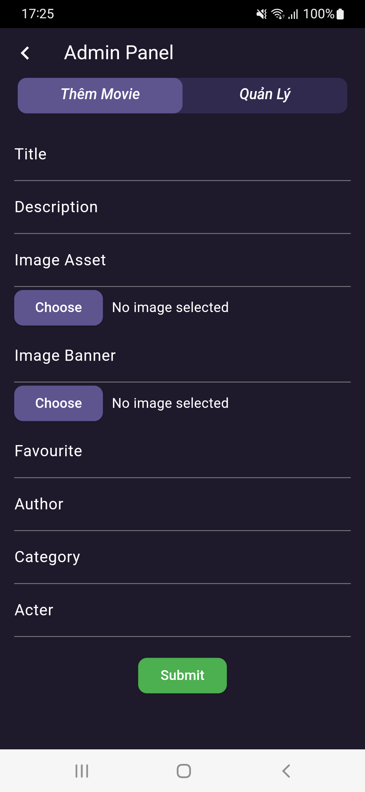
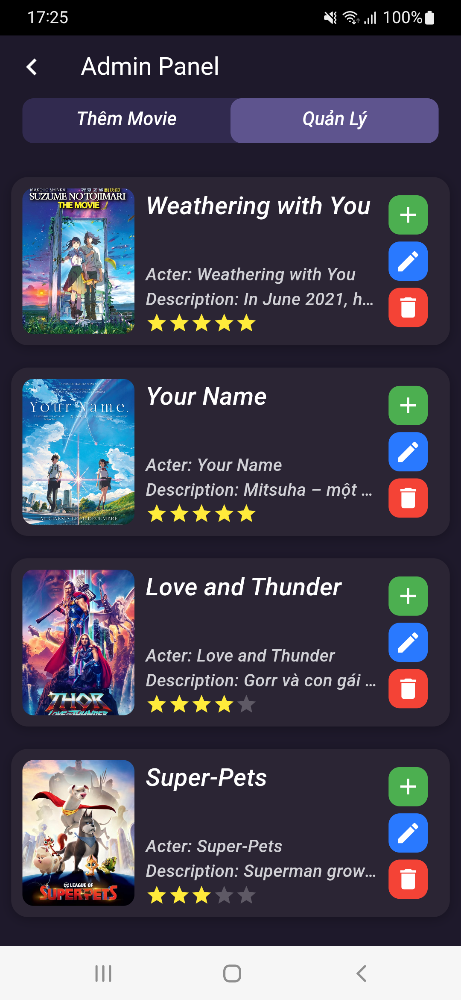
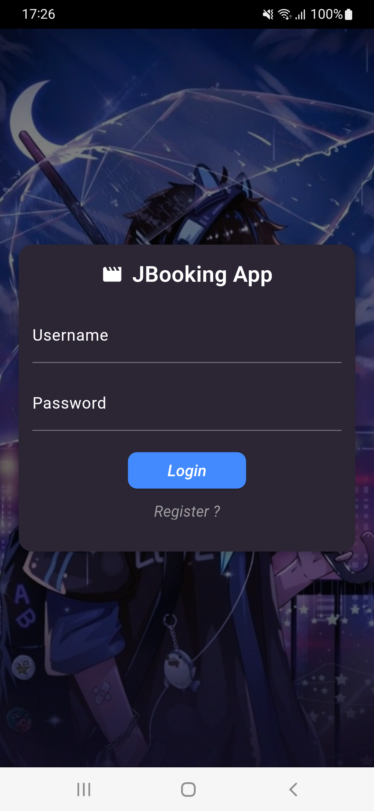
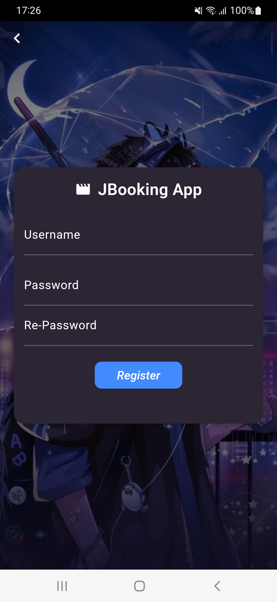
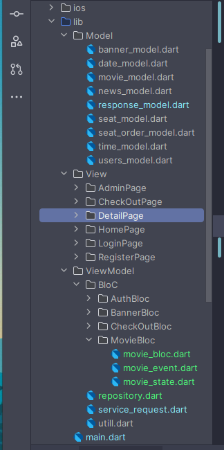

# Movie Ticket Booking

A movie tickets booking application using **Flutter** and **Nodejs Express**.

## Features

- Using MVVM Architecture
- Flutter BloC Pattern for State management
- Backend using Nodejs Express, Mongodb database

## View Screenshots

    
    
    
    
    
    
    
    

